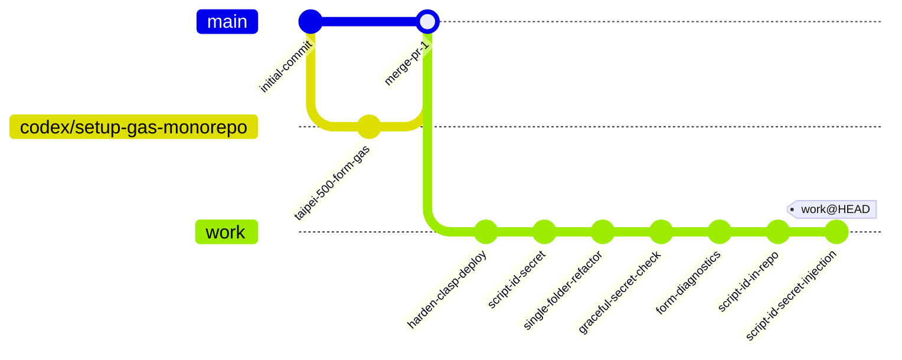
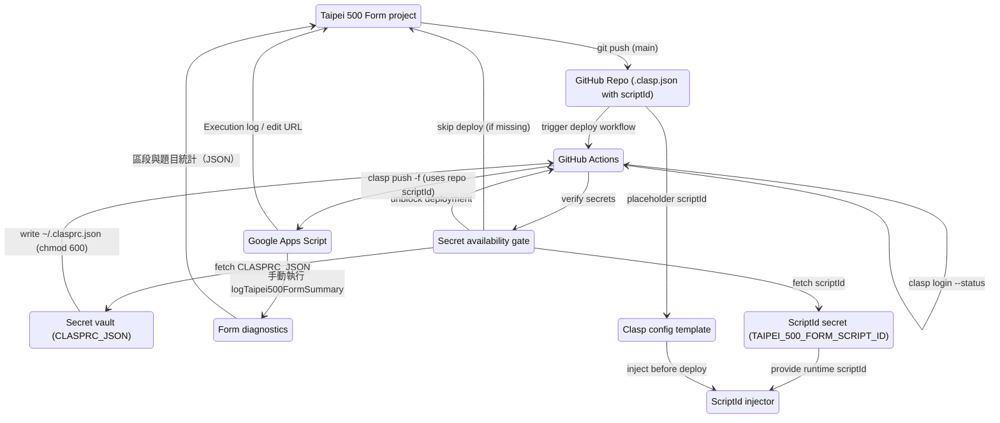
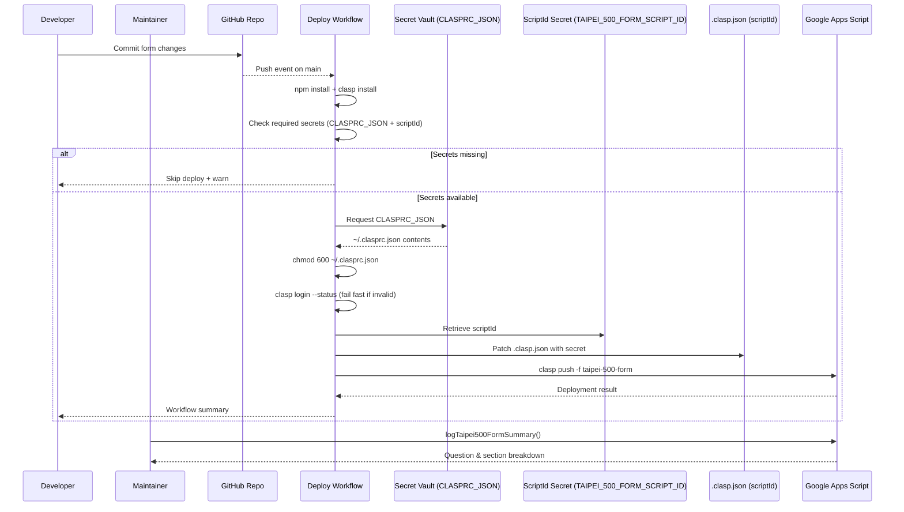

# clasp-from-fresh







```mermaid
flowchart LR
    Dev[Developer]
    Repo[Repo (taipei-500-form)]
    Secrets[GitHub Secret: CLASPRC_JSON]
    ScriptIdSecret[GitHub Secret: TAIPEI_500_FORM_SCRIPT_ID]
    SecretCheck[Secret availability gate]
    Workflow[Deploy Workflow]
    ClaspConfig[.clasp.json (scriptId in repo)]
    ScriptIdInjector[ScriptId injector script]
    GAS[Apps Script Project]
    Form[Google Form]
    Dev -->|clasp / git| Repo
    Repo -->|CI trigger| Workflow
    Workflow -->|checks| SecretCheck
    SecretCheck -->|needs| Secrets
    SecretCheck -->|needs| ScriptIdSecret
    Secrets -->|writes ~/.clasprc.json + chmod 600| Workflow
    ScriptIdSecret -->|provides scriptId| ScriptIdInjector -->|mutates before deploy| ClaspConfig
    SecretCheck -->|unblocks| Workflow
    Repo -->|placeholder scriptId| ClaspConfig -->|awaits injection| ScriptIdInjector
    SecretCheck -->|warn + skip| Dev
    Workflow -->|clasp push -f| GAS
    GAS -->|renders| Form
    Form -->|responses| GAS
    Maint[Maintainer]
    Diagnostics[Form diagnostics helper]
    Maint -->|manual QA| Diagnostics
    Diagnostics -->|read-only access| GAS
    Diagnostics -->|section snapshot| Maint
```

```mermaid
flowchart LR
    subgraph Users
        A[提名人]
        Maint[維運者]
    end
    subgraph Frontend
        Form[Google Form: 台北 500 盤評選]
    end
    subgraph Backend
        CI[Deploy Workflow]
        SecretGate[Secret availability gate]
        Secret[CLASPRC_JSON]
        ScriptIdSecret[TAIPEI_500_FORM_SCRIPT_ID]
        ClaspConfig[Repo .clasp.json (scriptId)]
        ScriptIdInjector[ScriptId injector script]
        Script[Apps Script builder]
        Perms[chmod 600]
        Diagnostics[Form diagnostics helper]
    end
    A -->|填寫| Form -->|Responses| Script
    Script -->|Creates/updates form| Form
    Maint -->|監控| CI -->|安全驗證| SecretGate
    SecretGate -->|檢查| Secret
    SecretGate -->|檢查| ScriptIdSecret
    Maint -->|維護| Repo + Script
    Secret -->|寫 ~/.clasprc.json| CI -->|chmod 600| Perms
    ScriptIdSecret -->|scriptId 值| ScriptIdInjector -->|更新| ClaspConfig -->|scriptId 與 rootDir| CI
    CI -->|push (when secrets ok)| Script
    Maint -->|手動執行 logTaipei500FormSummary / getTaipei500FormItemSnapshot| Diagnostics
    Diagnostics -->|讀取表單題目| Script
    Diagnostics -->|輸出統計| Maint
```

## Taipei 500 Form Google Apps Script project

這個 repo 現在只追蹤一個 Google Apps Script 專案，所有程式碼都集中在 `taipei-500-form/` 目錄，讓流程維持「GAS code → repo → GitHub Action → GAS」的單一路徑。

### 資料夾結構

```text
.
├── .github/workflows/deploy-gas.yml  # 單一 workflow，部署 taipei-500-form
├── README.md                         # 本說明文件與 Mermaid 示意
├── package.json / package-lock.json  # 共用的 clasp 套件版本
├── scripts/set-clasp-script-id.mjs   # 以 Secret 注入 scriptId 的工具
└── taipei-500-form/
    ├── .clasp.json                   # 以 placeholder 等待 Secret 注入
    ├── appsscript.json               # GAS manifest，Asia/Taipei + scopes
    ├── Code.js                       # 建立「台北 500 盤評選」Google Form
    └── FormDiagnostics.js            # 區段與題目統計的手動 QA 入口
```

### scriptId 與憑證策略

* `scriptId` 雖然不是敏感憑證，但為避免將實際專案 ID 公開在教學 repo 內，預設以 placeholder (`__REPLACE_WITH_SCRIPT_ID__`) 提交。
* `scripts/set-clasp-script-id.mjs` 會將 Secret（或本機輸入）的 scriptId 寫入 `taipei-500-form/.clasp.json`，確保 `clasp push/pull` 能找到正確專案。
* GitHub Actions 會在部署前同時檢查 `CLASPRC_JSON` 及 `TAIPEI_500_FORM_SCRIPT_ID` 兩個 Secret，缺少任一項就直接跳過部署，避免再次打 API 失敗。

### 設定 scriptId（本機與 CI）

1. 若要在本機 `clasp push` / `clasp pull`，請先執行 `CLASP_SCRIPT_ID=實際ID npm run set:script-id -- --path taipei-500-form`，讓 `.clasp.json` 取得正確的 scriptId。
2. GitHub Actions 中則透過 `TAIPEI_500_FORM_SCRIPT_ID` Secret 搭配同一個腳本注入 scriptId，部署前不需要額外手動修改檔案。


### 部署流程（GitHub Actions）

* `.github/workflows/deploy-gas.yml` 會在 `main` 推送或手動觸發後執行。
  * Workflow 步驟：
    1. 安裝 Node.js 20 與 `@google/clasp@^3.1.0`。
    2. 在執行部署前確認 `CLASPRC_JSON` 與 `TAIPEI_500_FORM_SCRIPT_ID` Secret 是否存在；若缺少就發出警告並跳過其餘步驟。
    3. 使用 `scripts/set-clasp-script-id.mjs` 將 Secret 中的 scriptId 寫入 `taipei-500-form/.clasp.json`。
    4. 將 GitHub Secret `CLASPRC_JSON` 寫入 `~/.clasprc.json` 並 `chmod 600`。
    5. 以 `clasp login --status` 驗證憑證是否可用。
    6. 在 `taipei-500-form/` 下執行 `clasp push -f` 部署表單。

### 必要 Secrets

| Secret 名稱 | 內容 | 用途 |
| --- | --- | --- |
| `CLASPRC_JSON` | `clasp login --no-localhost` 產生的 `~/.clasprc.json` | 還原 clasp 登入資訊以供 CI 驗證 |
| `TAIPEI_500_FORM_SCRIPT_ID` | 目標 Apps Script 專案 ID | 在 CI/CD 流程中注入 `.clasp.json` |

### 「台北 500 盤評選」Google Form 內容

`taipei-500-form/Code.js` 會建立與更新專屬的 Google Form，重複部署可確保題目與必填規則一致：

* **提名人資訊**：姓名、聯絡方式、參與身份（含其他選項）。
* **餐廳與料理提名**：餐廳名稱、行政主廚、行政區（台北 12 區 + 外縣市）、必吃料理、推薦理由、體驗評分（1–5 分 Likert）。
* **用餐經驗**：造訪頻率（可複選）、心得與建議、是否願意接受專訪。
* **補充資料**：照片／影音連結、上傳佐證資料（最多 5 個檔案，每個 10 MB）、給評選團隊的悄悄話。

主要函式：

* `deployTaipei500Form`：CI/CD 入口，重建表單並在日誌輸出編輯連結。
* `buildTaipei500Form`：設定表單標題、描述、題目與必填規則。
* `resetTaipei500FormId`：清除 Script Properties 中的 Form ID，以便重新建立全新表單。
* `logTaipei500FormSummary`：讀取既有表單並輸出各區段的題型統計，方便在 Apps Script 新檔案中檢查內容。
* `getTaipei500FormItemSnapshot`：產出 JSON 陣列，列出各節與題目標題，可貼回 issue 或 PR 協助審閱。

### 手動 QA：FormDiagnostics.js

當在 Apps Script 新增檔案或需要檢查題目順序時，可在 Apps Script 編輯器內執行：

1. `logTaipei500FormSummary`：於日誌顯示每個區段的題目數與題型分佈。
2. `getTaipei500FormItemSnapshot`：在日誌輸出 JSON 結構，可複製到其他系統或 PR 描述中。

這些函式只讀既有表單，不會刪除或新增題目。

### 本機開發與測試

1. 安裝依賴：`npm install`（已生成 `package-lock.json`）。
2. 全域安裝 `@google/clasp@^3.1.0` 並 `clasp login --no-localhost`，將 `~/.clasprc.json` 內容存入 GitHub Secret `CLASPRC_JSON`（供 CI 使用）。
3. 使用 `CLASP_SCRIPT_ID=實際ID npm run set:script-id -- --path taipei-500-form` 產生正確的 `.clasp.json`，再執行 `clasp push` 或 `clasp pull`。
4. 推送到 `main` 或以 `workflow_dispatch` 手動觸發部署 workflow，確認 `Deploy Taipei 500 Form` 全數成功。
