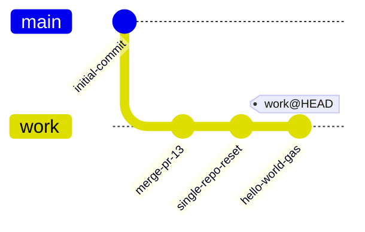
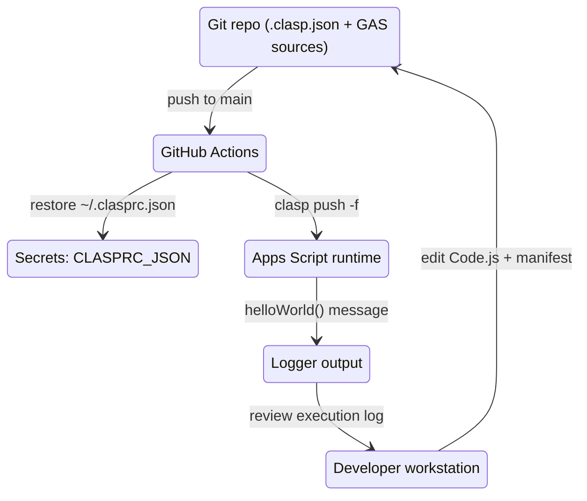
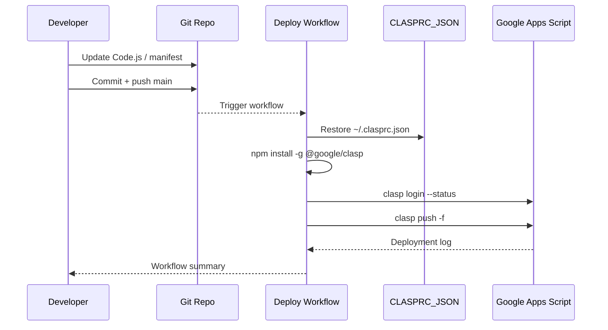
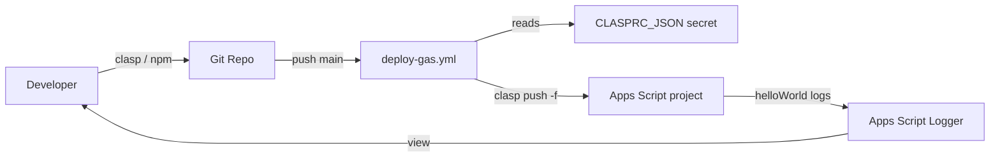
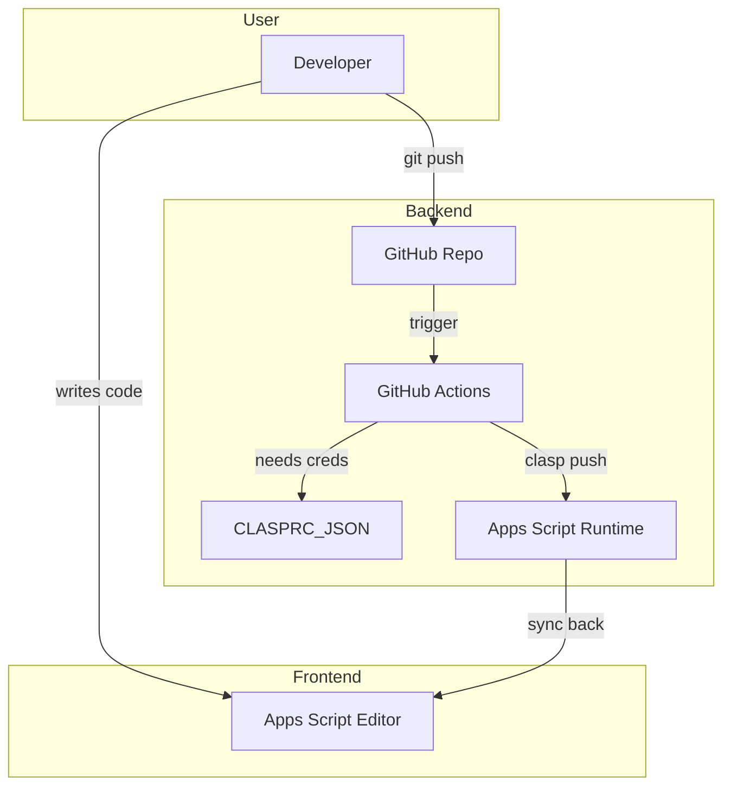

# Single repo Google Apps Script starter











## Overview

This repository now hosts a single Google Apps Script project at the root so it can be deployed directly with `clasp` and GitHub Actions. The code exposes a minimal `helloWorld` function that writes a message to the execution log and a `createTaipeiCoffeeShopSlides` helper that builds a multi-slide Google Slides tour of Taipei coffee shops while logging the generated deck URL.

## Repository layout

```text
.
├─ .clasp.json          # Points clasp at your standalone Apps Script project
├─ appsscript.json      # Minimal manifest (V8 runtime, Asia/Taipei)
├─ Code.js              # helloWorld() implementation
├─ package.json         # Optional tooling definition
└─ .github/workflows/
   └─ deploy-gas.yml    # Push to GAS on main
```

## Getting started locally

1. Install dependencies once: `npm install`.
2. Replace `YOUR_SCRIPT_ID_HERE` in `.clasp.json` with your project ID (Apps Script editor → **Project settings → Script ID**).
3. Run `npx clasp login --no-localhost` to create `~/.clasprc.json` locally.
4. Deploy from the repo root with `npm run deploy` (runs `clasp push -f`).

## Continuous deployment via GitHub Actions

The workflow in `.github/workflows/deploy-gas.yml` deploys on pushes to `main` and manual triggers. It:

1. Checks out the repo.
2. Installs Node.js 20 and `@google/clasp@^3.1.0` globally.
3. Restores the `~/.clasprc.json` credentials from the `CLASPRC_JSON` secret.
4. Validates the login with `clasp login --status`.
5. Runs `clasp push -f` to publish the Apps Script project referenced by `.clasp.json`.

### Required GitHub secret

| Secret name      | Purpose |
| ---------------- | ------- |
| `CLASPRC_JSON`   | Contents of the local `~/.clasprc.json` generated by `clasp login --no-localhost`; the workflow writes this file so it can authenticate before pushing. |

## Useful commands

| Command | Description |
| ------- | ----------- |
| `npm install` | Installs `@google/clasp` locally so you can run it via `npx` or scripts. |
| `npm run deploy` | Runs `clasp push -f` using the repo’s `.clasp.json`. |
| `npx clasp logs --json` | View execution logs after calling `helloWorld` from the Apps Script editor. |

With these files in place you can connect this repo to any standalone Apps Script project, edit `Code.js`, and rely on GitHub Actions to keep the remote script in sync.
