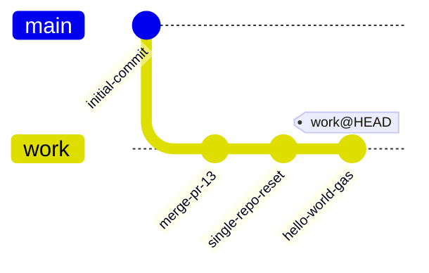

# Multi-app Google Apps Script starter



## Overview

The repository now accommodates multiple `clasp`-driven Google Apps Script
projects. Each project lives under `apps-script/<app-name>/` with its own
`.clasp.json`, manifest, and source files while keeping `"rootDir": "."` so the
folder contents map directly to Apps Script.

A top-level optional `shared/` directory is also available for reusable snippets
or documentation that developers want to copy into either project.

## Repository layout

```text
.
├─ apps-script/
│  ├─ gas-main-app/          # Existing helloWorld + Slides helper source
│  │  ├─ .clasp.json         # Points clasp at scriptId 105Da...
│  │  ├─ appsscript.json     # Manifest (V8 runtime, Asia/Taipei)
│  │  └─ Code.js             # helloWorld + createTaipeiCoffeeShopSlides
│  └─ gas-second-app/        # Placeholder for scriptId 1s-wTbfE...
│     ├─ .clasp.json         # Already configured with rootDir "."
│     └─ README.md           # Notes about cloning/pulling the remote code
├─ shared/                   # Optional reusable snippets or docs
│  └─ README.md
├─ package.json              # Contains the `deploy` npm script
├─ package-lock.json
├─ node_modules/
└─ .github/workflows/
   └─ deploy-gas.yml         # Pushes the currently scoped .clasp project
```

## Working with the main Apps Script project

1. Install dependencies once: `npm install`.
2. Authenticate `clasp` locally (`npx clasp login --no-localhost`).
3. From `apps-script/gas-main-app/`, deploy changes with `npx clasp push -f` or
   from the repo root via `npm run deploy` (uses the default `.clasp.json` in the
   working directory).
4. Update `Code.js` / `appsscript.json` inside the folder. The manifest already
   enables the V8 runtime and sets the Asia/Taipei time zone.

## Setting up the second Apps Script project

The folder `apps-script/gas-second-app/` is prepared for script ID
`1s-wTbfES7k69y0xn8dtTRkXVyv-8Vl6lm2GS8GX363WPW_gmwl6RAc09`. Because Google
authentication is required, run the clone locally once you have credentials:

```bash
cd apps-script/gas-second-app
npx clasp clone 1s-wTbfES7k69y0xn8dtTRkXVyv-8Vl6lm2GS8GX363WPW_gmwl6RAc09 --rootDir .
```

This will download the remote manifest and sources directly into the folder
alongside the already-checked-in `.clasp.json`.

## Using the shared snippets directory

Add utility scripts or documentation inside `shared/`. These files are not wired
into either Apps Script project automatically—they serve as a scratch space for
copy/paste friendly utilities.

## Continuous deployment via GitHub Actions

The workflow in `.github/workflows/deploy-gas.yml` still deploys on pushes to
`main`. Ensure the working directory for the job is set to whichever project you
intend to publish (default is the repository root, so you can run the workflow
from within `apps-script/gas-main-app/` by adding a `working-directory` override
or by temporarily copying the appropriate `.clasp.json` into the job).

### Required GitHub secret

| Secret name      | Purpose |
| ---------------- | ------- |
| `CLASPRC_JSON`   | Contents of the local `~/.clasprc.json` generated by `clasp login --no-localhost`; the workflow writes this
 file so it can authenticate before pushing. |

## Useful commands

| Command | Description |
| ------- | ----------- |
| `npm install` | Installs `@google/clasp` locally so you can run it via `npx` or scripts. |
| `npm run deploy` | Runs `clasp push -f` using the repo’s `.clasp.json`. Execute from within the target Apps Script folder. |
| `npx clasp logs --json` | View execution logs after calling `helloWorld` from the Apps Script editor. |
