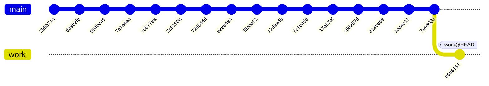
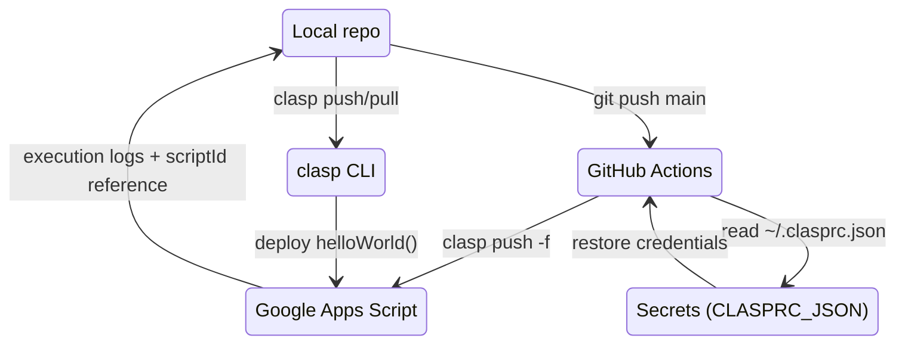
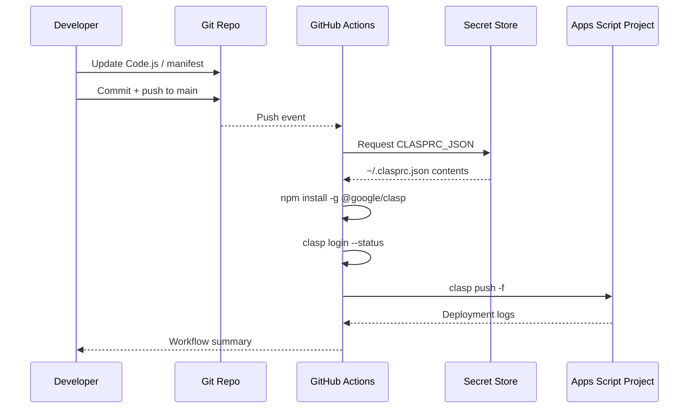
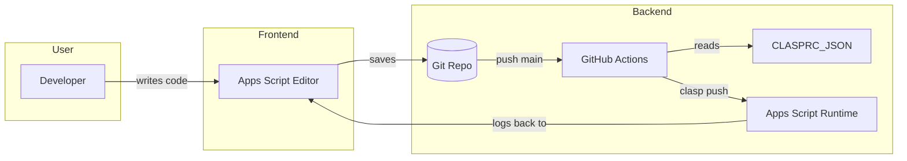

# Single Google Apps Script repo







```mermaid
flowchart LR
    Dev[Developer]
    Repo[(Single GAS repo)]
    Workflow[GitHub Actions deploy-gas.yml]
    Secret[CLASPRC_JSON Secret]
    Clasp[@google/clasp]
    GAS[Apps Script Project]
    Dev -->|edit + commit| Repo
    Repo -->|push main| Workflow
    Workflow -->|restore| Secret
    Workflow -->|install| Clasp
    Workflow -->|run clasp push -f| GAS
    GAS -->|Logger.log| Workflow
    Workflow -->|status| Dev
```



## Overview

This repository now holds a single Google Apps Script project at the root so that local development, deployment, and CI/CD remain straightforward. The workflow mirrors a typical clasp-based setup: edit `Code.js`, commit changes, and push to `main` to trigger the deploy workflow.

## Repository layout

```text
.
├─ .clasp.json
├─ appsscript.json
├─ Code.js
├─ package.json
└─ .github/
   └─ workflows/
      └─ deploy-gas.yml
```

* **Code.js** – contains the `helloWorld` function that logs a message with `Logger.log`.
* **appsscript.json** – minimal manifest that enables the V8 runtime, STACKDRIVER exception logging, and sets the timezone to Asia/Taipei.
* **.clasp.json** – points clasp at this directory (`rootDir: "."`) and needs the real `scriptId` from your Apps Script project settings.
* **package.json** – optional helper that pins `@google/clasp@^3.1.0` and exposes an npm `deploy` script for local pushes.
* **.github/workflows/deploy-gas.yml** – GitHub Actions workflow that installs clasp, restores credentials from the `CLASPRC_JSON` secret, and runs `clasp push -f` whenever `main` updates (or via manual dispatch).

## Getting started

1. Install clasp locally: `npm install -g @google/clasp@^3.1.0`.
2. Create or clone an Apps Script project and copy its Script ID into `.clasp.json` (replacing `YOUR_SCRIPT_ID_HERE`).
3. Run `clasp login --no-localhost`, then copy the contents of `~/.clasprc.json` into a GitHub repository secret named `CLASPRC_JSON` so CI can authenticate.
4. Use `npm run deploy` locally, or push to `main` to let GitHub Actions run the exact same `clasp push -f` command for you.

## Workflow details

* **Trigger conditions** – pushes to `main` plus manual `workflow_dispatch` events.
* **Node runtime** – Node.js 20 with the latest 3.x clasp release.
* **Secrets** – only `CLASPRC_JSON` is required; it is written to `~/.clasprc.json` inside the workflow runner before `clasp login --status` and `clasp push -f` execute.
* **Output** – deployments log to the workflow summary and to the Apps Script execution transcript, so you can confirm `helloWorld()` ran successfully.

## Extending the project

* Add more `.gs` or `.js` files alongside `Code.js` and update `appsscript.json` scopes as needed.
* Expand the GitHub Actions workflow if you require linting, unit tests, or deployment gates.
* Replace the placeholder script ID before pushing secrets or expecting deployments to succeed.
