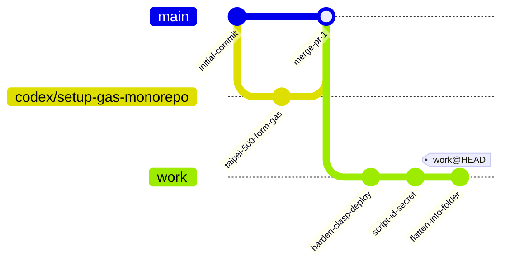
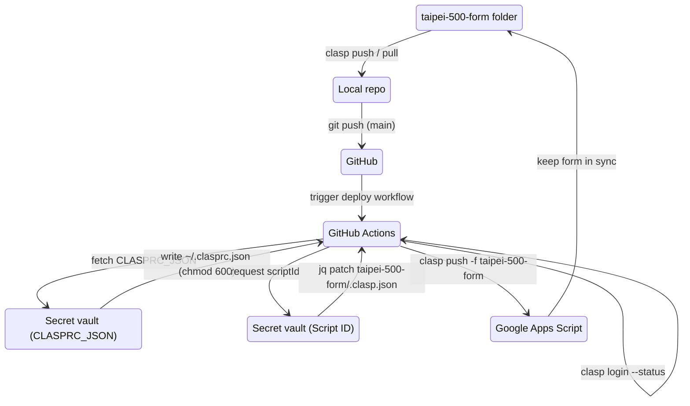
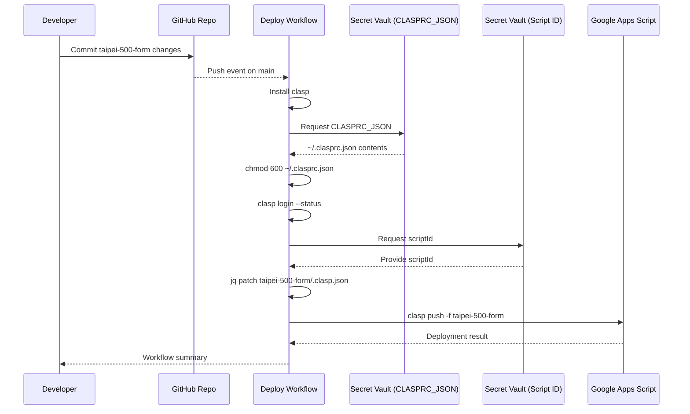
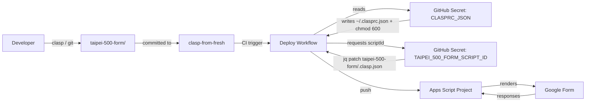
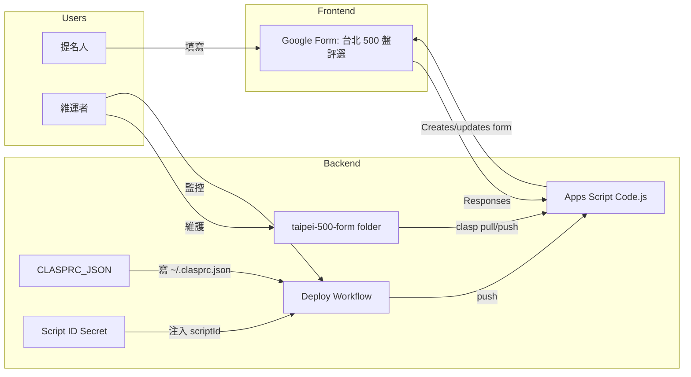

# clasp-from-fresh











## Google Apps Script 專案結構與部署規則

現在的 repo 只維護單一的「台北 500 盤評選」專案，所有 GAS 程式碼都集中在 `taipei-500-form/` 目錄中，流程也簡化為「GAS code → repo → GitHub Action → GAS」。

### 資料夾結構

```text
taipei-500-form/
  .clasp.json       # CI 會依據 GitHub Secret 注入 scriptId，rootDir 固定為 "."
  appsscript.json   # GAS manifest，已設定 Asia/Taipei 與所需 scopes
  Code.js           # 建立「台北 500 盤評選」Google Form 的程式碼

.github/workflows/deploy-gas.yml  # 單一 workflow，直接部署 taipei-500-form
package.json / package-lock.json  # 提供 clasp 版本鎖定，可依需求執行 npm scripts
```

### 部署流程（GitHub Actions）

* `.github/workflows/deploy-gas.yml` 在 `main` 推送或手動觸發時啟動。
* Workflow 只針對 `taipei-500-form` 執行以下步驟：
  1. 安裝 Node.js 20 與 `@google/clasp@^3.1.0`。
  2. 將 GitHub Secret `CLASPRC_JSON` 寫入 `~/.clasprc.json` 並立即 `chmod 600` 鎖定權限。
  3. 執行 `clasp login --status` 以確認授權。
  4. 透過 `jq` 以 GitHub Secret `TAIPEI_500_FORM_SCRIPT_ID` 覆寫 `taipei-500-form/.clasp.json`。
  5. 在 `taipei-500-form` 目錄下執行 `clasp push -f` 完成部署。

### 必要 Secrets

| Secret 名稱 | 內容 | 用途 |
| --- | --- | --- |
| `CLASPRC_JSON` | `clasp login --no-localhost` 產生的 `~/.clasprc.json` 全文 | 重建 `~/.clasprc.json` 並限制權限，以便 CI 對 Google 帳戶驗證 |
| `TAIPEI_500_FORM_SCRIPT_ID` | `taipei-500-form` 實際 scriptId（例：`1abc...`） | 由 CI 以 `jq` 寫入 `.clasp.json`，確保 `clasp push -f` 指向正確專案 |

### 如果需要建立其他專案

目前 repo 沒有維護其他 GAS 專案；若未來要加入，可在根目錄新增資料夾並複製 workflow job。此 README 開頭的 Mermaid 圖需要一併更新。

## 「台北 500 盤評選」Google Form 內容

`taipei-500-form/Code.js` 會建立並維護專屬的 Google Form，重複部署可確保題目順序一致：

* **提名人資訊**：姓名、聯絡方式、參與身份（含其他選項）。
* **餐廳與料理提名**：餐廳名稱、行政主廚、行政區（下拉選單覆蓋台北 12 區與外縣市）、必吃料理、推薦理由、體驗評分（1–5 分 Likert）。
* **用餐經驗**：造訪頻率（可複選）、心得與建議、是否願意接受專訪。
* **補充資料**：照片／影音連結、上傳佐證資料（最多 5 個檔案，每個 10 MB）、給評選團隊的悄悄話。

主要函式：

* `deployTaipei500Form`：CI/CD 驗證入口，重建表單並在日誌輸出編輯連結。
* `buildTaipei500Form`：設定表單標題、描述、題目與必填規則。
* `resetTaipei500FormId`：清除 Script Properties 中的 Form ID，可在需要時重新建立全新表單。

## 本機開發與測試

1. 安裝依賴：`npm install`（已生成 `package-lock.json`）。
2. 全域安裝 `@google/clasp@^3.1.0` 並 `clasp login --no-localhost`，將 `~/.clasprc.json` 內容存入 GitHub Secret `CLASPRC_JSON`。
3. 在 `taipei-500-form` 內設定正確的 `scriptId`（可使用 CI Secret 的值）後，執行 `clasp push` 或 `clasp pull` 以同步 Google Apps Script 專案。
4. 將變更推送到 `main` 或以 `workflow_dispatch` 手動觸發部署工作，確認 CI 內 `Deploy Google Apps Script (taipei-500-form)` workflow 全數成功。
