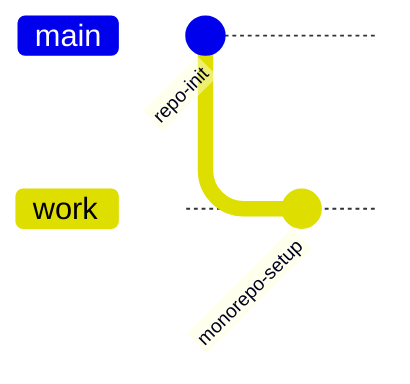
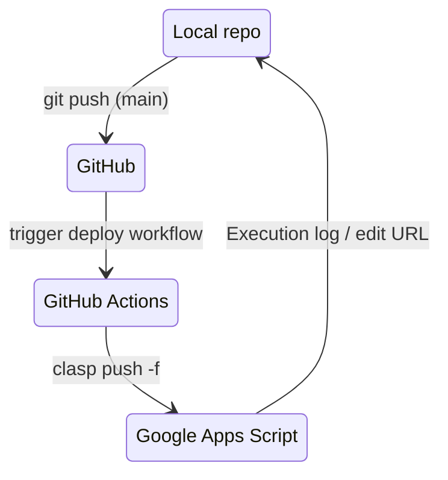
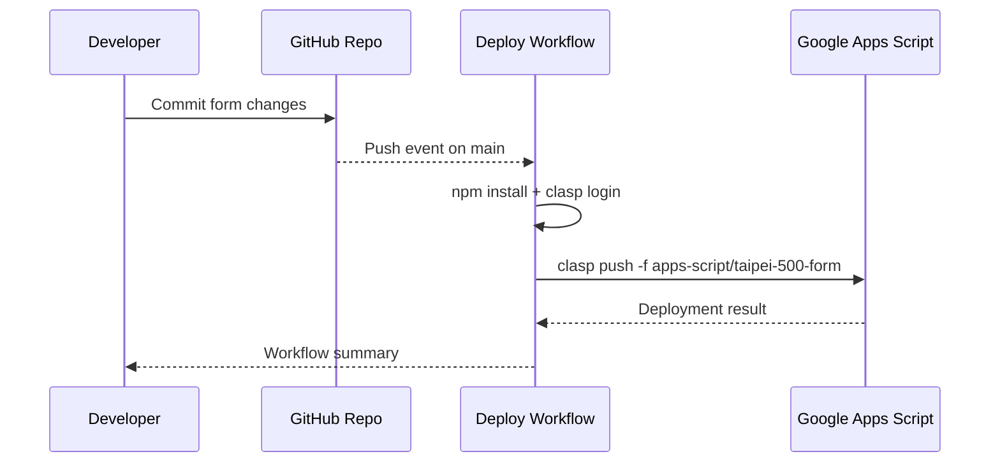
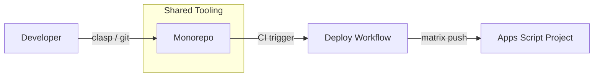
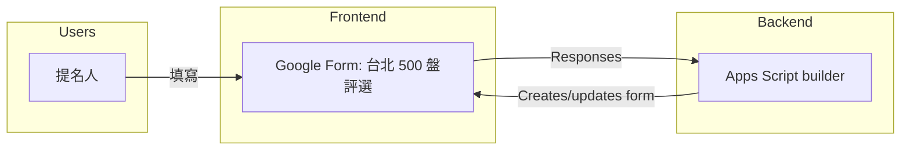

# clasp-from-fresh











## Google Apps Script 專案結構與部署規則

本 repo 採用 monorepo 方式管理所有 Google Apps Script（GAS）專案；所有 GAS 專案都放在 `apps-script/` 目錄底下，每一個子資料夾對應到一個獨立的 Apps Script 專案。

### 資料夾結構

```text
apps-script/
  taipei-500-form/
    .clasp.json       # 指向實際的 Apps Script scriptId，rootDir 固定為 "."
    appsscript.json   # GAS manifest，已設定 Asia/Taipei 與所需 scopes
    Code.js           # 建立「台北 500 盤評選」Google Form 的程式碼

shared/
  example-utils.js    # 可複製到各專案使用的共用工具示範

package.json          # 共用工具鏈（clasp、lint、format）
package-lock.json     # npm 安裝鎖定檔
```

### 命名與設定規則

* 專案資料夾名稱一律使用小寫 + `-`（kebab-case），例如 `taipei-500-form`。
* 每個專案資料夾內必須有自己的 `.clasp.json`，並且 `"rootDir": "."`，讓 `clasp push` 只部署該子資料夾。
* 共用的工具或設定（`shared/`、`package.json`、`.github/` 等）放在 repo 根目錄，供所有 Apps Script 專案共用。

### 部署流程（GitHub Actions）

* `.github/workflows/deploy-gas.yml` 在 `main` 推送或手動觸發時啟動。
* Workflow 使用 matrix，一筆一專案。目前只包含 `apps-script/taipei-500-form`，未來可再加入其他子資料夾。
* 每個 matrix 工作都會：
  1. 安裝 Node.js 20 與 `@google/clasp@^3.1.0`。
  2. 將 GitHub Secret `CLASPRC_JSON` 寫入 `~/.clasprc.json`。
  3. 執行 `clasp login --status` 以確認授權。
  4. 在對應子資料夾下執行 `clasp push -f` 完成部署。

### 新增專案流程

1. 在 `apps-script/` 底下建立新的 `<project-name>/` 資料夾（kebab-case）。
2. 在該資料夾中執行 `clasp create` 或 `clasp clone` 產生 `.clasp.json` 與 `appsscript.json`。
3. 建立專案程式碼後，更新 `README.md`（包含 Mermaid 圖）與 `.github/workflows/deploy-gas.yml` 的 matrix。
4. 提交變更並推送到 `main`，GitHub Actions 會自動針對所有列出的專案 `clasp push -f`。

## 「台北 500 盤評選」Google Form 內容

`apps-script/taipei-500-form/Code.js` 會建立並維護專屬的 Google Form，重複部署可確保題目順序一致：

* **提名人資訊**：姓名、聯絡方式、參與身份（含其他選項）。
* **餐廳與料理提名**：餐廳名稱、行政主廚、行政區（下拉選單覆蓋台北 12 區與外縣市）、必吃料理、推薦理由、體驗評分（1–5 分 Likert）。
* **用餐經驗**：造訪頻率（可複選）、心得與建議、是否願意接受專訪。
* **補充資料**：照片／影音連結、上傳佐證資料（最多 5 個檔案，每個 10 MB）、給評選團隊的悄悄話。

主要函式：

* `deployTaipei500Form`：CI/CD 驗證入口，重建表單並在日誌輸出編輯連結。
* `buildTaipei500Form`：設定表單標題、描述、題目與必填規則。
* `resetTaipei500FormId`：清除 Script Properties 中的 Form ID，可在需要時重新建立全新表單。

## 本機開發與測試

1. 安裝依賴：`npm install`（已生成 `package-lock.json`）。
2. 全域安裝 `@google/clasp@^3.1.0` 並 `clasp login --no-localhost`，將 `~/.clasprc.json` 內容存入 GitHub Secret `CLASPRC_JSON`。
3. 在 `apps-script/taipei-500-form` 內執行 `clasp push` 或 `clasp pull` 以同步 Google Apps Script 專案。
4. 將變更推送到 `main` 或以 `workflow_dispatch` 手動觸發部署工作，確認 CI 內 `Deploy Google Apps Script (monorepo)` workflow 全數成功。
